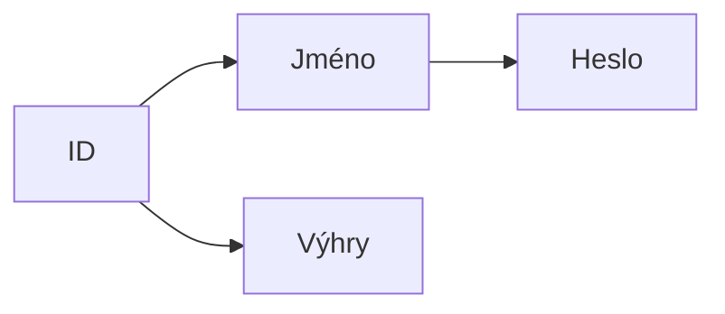

# Hangman

## K dokončení
- [X] Registrace a přihlášení 
- [ ] FUNKČNÍ registrace a přihlášení
- [X] Databáze
- [ ] Logika hry
- [ ] Input
- [ ] Output
- [ ] Funkční hratelnost

## Problémy
- Při obnově hesla se nepošle email
- Nejde se přihlásit
- Neznámá funkčnost registrace, jméno a email se "zaberou" ale nejde se 
skrze ně přihlásit

## Návrh databáze

ID: INT  
NAME: STRING  
WINS: INT  
